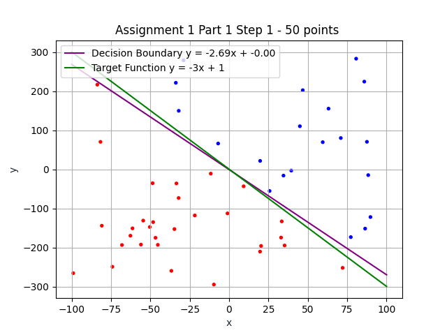
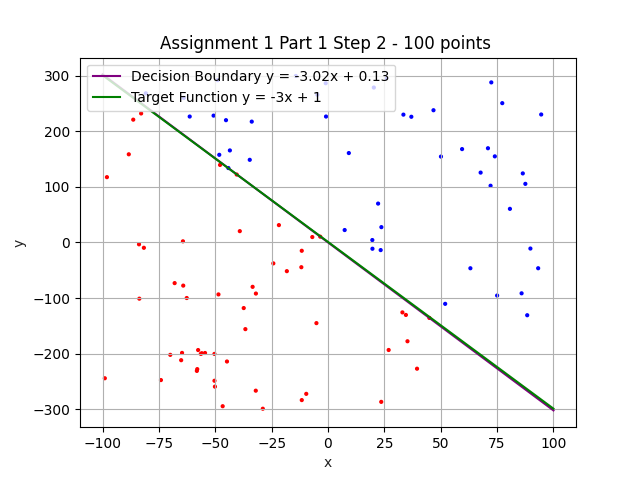
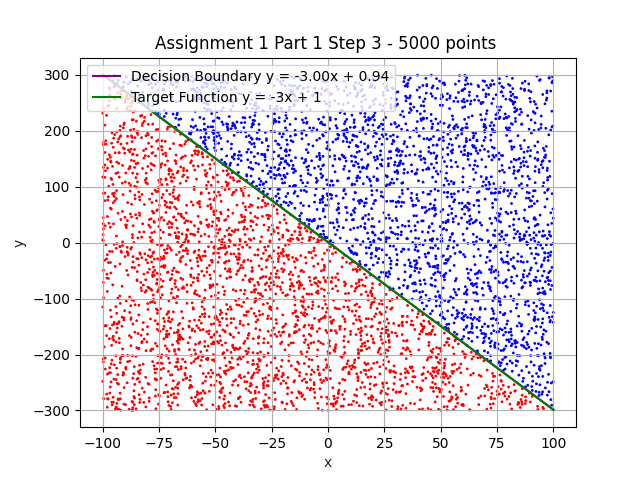

## CMPE 462 Assignment 1

### Part 1

* Samples are randomly chosen from `[-100,100)` range for `x` and `[-300,300)` range for `y`. 
Range of y is 3 times that of x, in order to make sure the final plot looks full 
while the target function plot line is fully visible for that range.
 
* Random seed can be set by changing the global variable `RANDOM_SEED`
By default it is kept as None (numpy requests a random seed from os)

* Below are the results and plots for each step with `RANDOM_SEED=12345` 

#### Step 1
```
Finished calculation in 25 iterations
Calculated weights are: [  0.         531.02365676 197.25030511]
Decision Boundary is y = -2.69x + -0.00
```

#### Step 2
```
Finished calculation in 119 iterations
Calculated weights are: [ -50.         1122.35262344  371.32963463]
Decision Boundary is y = -3.02x + 0.13
```

#### Step 3
```
Finished calculation in 23867 iterations
Calculated weights are: [-6418.         20547.05277251  6856.03386458]
Decision Boundary is y = -3.00x + 0.94
```

    
#### Part 1 Overview

When we check out above results, we can see 
that the decision boundary gets closer to the original target function 
as the number of sampled points are increased.

Also, as the number of sampled points are increased, 
PLA needs to make much more iterations to fully converge.

TODO maybe add table
See below table for comparing above results.

### Part 2

#### Step 1
TODO
#### Step 2
TODO
#### Step 3
TODO