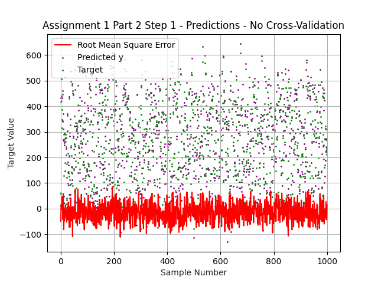
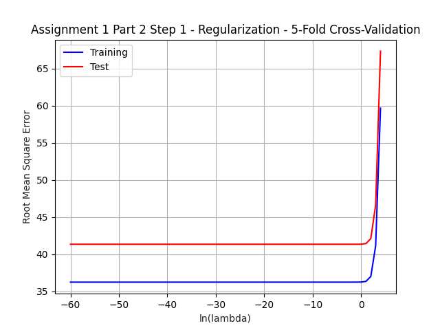
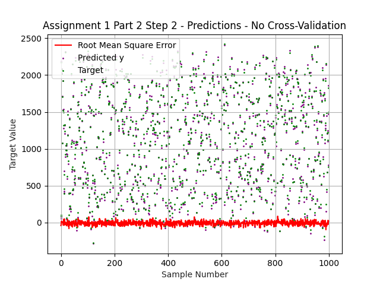
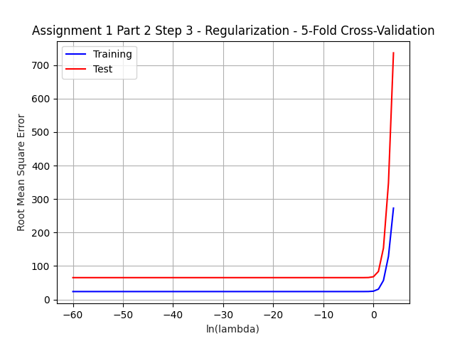

# CMPE 462 Assignment 1 Report

## Part 1

* Samples are randomly chosen from `[-100,100)` range for `x` and `[-300,300)` range for `y`. 
Range of y is 3 times that of x, in order to make sure the final plot looks full 
while the target function plot line is fully visible for that range.
 
* Random seed can be set by changing the global variable `RANDOM_SEED`
By default it is kept as None (numpy requests a random seed from os)

* Below are the results and plots for each step with `RANDOM_SEED=12345` 

### Step 1
```
Finished calculation in 25 iterations
Calculated weights are: [  0.         531.02365676 197.25030511]
Decision Boundary is y = -2.69x + -0.00
```

### Step 2
```
Finished calculation in 119 iterations
Calculated weights are: [ -50.         1122.35262344  371.32963463]
Decision Boundary is y = -3.02x + 0.13
```

### Step 3
```
Finished calculation in 23867 iterations
Calculated weights are: [-6418.         20547.05277251  6856.03386458]
Decision Boundary is y = -3.00x + 0.94
```

    
### Part 1 Overview

When we check out above results, we can see 
that the decision boundary gets closer to the original target function 
as the number of sampled points are increased.

Also, as the number of sampled points are increased, 
PLA needs to make much more iterations to fully converge.

See below table for comparing above results.


|Step| Samples | Iterations |y = -3x + 1|
|--|--|--|--|
|1|50|25|y = -2.69x + -0.00|
|2|100|119|y = -3.02x + 0.13|
|3|5000|23867|y = -3.00x + 0.94|


## Part 2

* Implemented closed form solution, so there will not be any loss over iterations graphs. 

* Chose to apply 5-fold cross validation, 
this can be changed via the global variable, `PART2_S_FOLD_S_VALUE` 

* Created a few supplementary graphs in order to get a better grasp of how well it predicts, and which lambda value to choose.

* Timing includes cross validation, but none of the extra-supplementary graph generations.

* Set `PART2_PLOT_PREDICTIONS=True` to create `part2_stepN_predictions.png` which 
shows predictions vs actual target values for each sample.

* Set `PART2_PLOT_LAMBDA_VALUES=True` to create `part2_stepN_regularization.png`
a graph of training & testing results (root mean square errors) over varying ln-lambda value. 
This will be same for step2 and step3 as expected, because they are only varied by regularization. 

* Chosen the lambda value for regularization as `e^-10` yet 
it is neither beneficial nor harmful, as it seems. 

* When we choose to do 2-fold cross validation instead, 
regularization becomes useful because of tolerating 
the lack of many training values causing over-fitting. 
But such analysis is out of this report's scope. 
If interested, one can set `PART2_S_FOLD_S_VALUE=2` and 
`PART2_PLOT_LAMBDA_VALUES=True` and run the program on part2, 
and check out the generated graph, `part2_stepN_regularization.png`.   

### Step 1
```
Applying 5-fold cross validation
There were 100 independent variables and 1 dependent variables
There were 1000 samples in total
Completed in 3.160 milliseconds
Average Erms_train = 36.257771814312136
Average Erms_test = 41.3584787667631
```


### Step 2
```
Applying 5-fold cross validation
There were 500 independent variables and 1 dependent variables
There were 1000 samples in total
Completed in 48.580 milliseconds
Average Erms_train = 23.6657974544233
Average Erms_test = 65.28337321386573
```


### Step 3
```
Applying 5-fold cross validation
There were 500 independent variables and 1 dependent variables
There were 1000 samples in total
Completed in 52.595 milliseconds
Average Erms_train = 23.665797456855017
Average Erms_test = 65.28335649367837
```




### Part 2 Overview

Since I implemented the close form solution, the time it takes mostly depends on 
the matrix multiplication operations applied to the input. Thus, time spent depends on 
the input size and how long constant number of matrix multiplication operations 
on that input takes. Matrix multiplication can be considered `O(N^2)` where N resembles 
the size of the whole input (not one dimension) 
Input size is `100 * 1000 = 100k` for step 1, and `500 * 1000 = 500k` for step 2-3. Since, `500k/100k = 5` and `5^2 = 25`, 
I would expect step 2/3 to take 25 times that of step 1. 
We can see in the below table a similar fashion can be observed. 
(The time spent varies across different runs but the ratio of time spent on step 1 vs 2/3 is around 25 as expected)

When we check out the Erms values of step 2 and 3, we can see that the regularization did not do any change. 
Can check out the regularization graphs above and deduce that choosing a higher lambda value doesn't perform better, and if chosen too big, causes under-fitting.

When we check out the Erms values of step 1 vs 2/3, we can see that step 1 performs worse on training result. 
That is probably related to the ratio of the number of independent variables to sample sizes. 
That's because unless there was a clear linear generation method for data, 
fitting a linear regression line gets harder to cover for samples as the sample size gets higher than the number of independent variables.
So maybe, applying a polynomial/logistic regression to step 1 might have performed better.  

When we check out the test Erms values however, step 1 actually does perform better. 
That's probably again because of the same ratio. Since the number of independent variables and samples are close in step 2/3, 
it has a higher chance of over-fitting, and that's why they're performing worse on test Erms.   

See below tables for comparing above results.

| Step | IV | Samples | L2 Lamda | Time (ms) | Train Erms | Test Erms |
|--|--|--|--|--|--|--|
| 1 | 100 | 1000 | - | 3.160 | 36.258 | 41.358 |
| 2 | 500 | 1000 | - | 48.580 | 23.666 | 65.283 |
| 3 | 500 | 1000 | λ = e^-10 | 52.595 | 23.665 | 65.283 |
IV: Independent Variables
Erms values are average of each run of s-fold cross-validation
Time is the time spent for calculating weights including cross-validation
Samples are the total number of samples before separating them for training and testing.
L2 Lambda is the lambda value used for L2 Regularization if applied, `-`, otherwise.