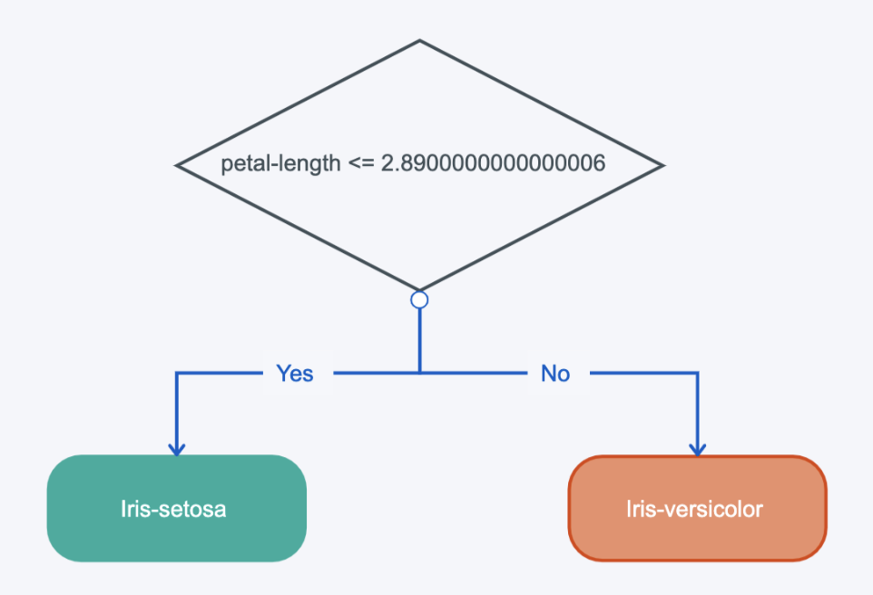

# CMPE 462 Assignment 1 Report

## Part 1

I have implemented the decision tree, represented as a recursive tuple of following:
```
(feature_index, threshold, lte_node, gt_node) | int
```
* feature_index is the index of the feature we use to do the current split.
* threshold is threshold number we use to compare the feature against
* lte_node is the subtree to follow if feature is less than or equal to the threshold
* gt_node is the subtree to follow if feature is greater than threshold
* a tree/subtree can be either a tuple as above or an integer representing the decided class.

Since all inputs are float values, I implemented it in a way that it assumes so. 
Above structure can be extended by adding a feature_type parameter maybe and don't include threshold for booleans.

I choose the simplest way to decide threshold values: calculating the mean value for the current feature of the elements of the current subtree. 
Of course, a more sophisticated approach can also be implemented, but this method was sufficient for the current dataset.

When I ran it across the dataset, I was somewhat disappointed seeing it consisted of only one split and its accuracy is `1.0`
It seems that it can do a perfect split by either `petal-length`, or `petal-width` feature.
In order to make sure it can form a tree via recursive behavior, I've modified some of the inputs to break the above fashion. Doing so I was able to obtain longer trees and validate that it works.

#### Step 1
Below is the output:
```
DT petal-length 1.00
```
Below is the tree it forms:
```
(2, 2.8900000000000006, 0, 1)
```



Below is a sample tree from the modified input:
```
(2, 2.915, 0, (2, 4.295121951219513, (2, 3.8176470588235296, (3, 1.3714285714285714, 1, 0), 1), 1))
```

#### Step 2
Below is the output:
```
DT petal-length 1.00
```
Below is the tree it forms:
```
(2, 2.8900000000000006, 0, 1)
```


Below is a sample tree from the modified input:
```
(2, 2.915, 0, (2, 4.295121951219513, (2, 3.8176470588235296, (3, 1.3714285714285714, 1, 0), 1), 1))
```

#### Part 1 Overview
I was able to validate that gain_ratio is applied on step 2 and not on step 1 while checking the calculations on debugger, but other than that 
it didn't seem to have an effect on the outputs, and a more complicated dataset is needed to do so.
Thus, both step 1 and step 2 outcomes are the same. It achieves perfect accuracy very easily.

Might try applying it on a totally randomly 
generated dataset in the future to check out the difference from information gain.


### Part 2

Overall, the implementation is pretty straightforward.
Something interesting was that I first received `WARNING: reaching max number of iterations` on some C values.
I checked out the related C++ source code and it works in a while loop with 
`while(iter<max_iter)`. So, the warning is important and the algorithm is stopped even if it didn't converge yet. 
I found out that if I apply normalization to the input features, it might make it converge faster and avoid the warning.
Thus, I applied normalization and it worked successfully. (Did not affected accuracy much, but improved it by ~1%)

I've chosen alternative c values as `0.01, 0.1, 1.0, 10.0, 100.0`
and ran across 4 kernel types `linear, polynomial, radial basis function, sigmoid` denoted by numbers as 0-3 respectively.

I've ran it for 5x4 times as all combination of c values and kernel types to get an overview, first. (See below table)
Then, I've chosen `c=10.0` and `kernel=0` as default values for step 1 and step 2

|Kernel|C|Accuracy|#Vectors|
|--|--|--|--|
|0|0.01|0.7692|346|  
|1|0.01|0.7692|346|  
|2|0.01|0.7692|346|  
|3|0.01|0.7692|346|  
|0|0.1|0.7751|346|  
|1|0.1|0.7692|346|  
|2|0.1|0.7692|346|  
|3|0.1|0.7692|346|  
|0|1.0|0.9645|267|  
|1|1.0|0.7692|346|  
|2|1.0|0.7692|346|  
|3|1.0|0.7692|346|  
|0|10.0|0.9763|127|  
|1|10.0|0.7692|346|  
|2|10.0|0.9527|295|  
|3|10.0|0.8876|335|  
|0|100.0|0.9882|65|  
|1|100.0|0.7692|346|  
|2|100.0|0.9763|145|  
|3|100.0|0.9704|180|

#### Part 2 Step 1
Below is the output:
```
SVM kernel=0 C=0.01 acc=0.7692307692307694 n=346
SVM kernel=0 C=0.1 acc=0.7751479289940828 n=346
SVM kernel=0 C=1.0 acc=0.9644970414201184 n=267
SVM kernel=0 C=10.0 acc=0.9763313609467456 n=127
SVM kernel=0 C=100.0 acc=0.9881656804733728 n=65
```
* We can see that number of support vectors decreases as C value increases.
* We can see that accuracy also increases by preventing possible overfit.

#### Part 2 Step 2
Below is the output:
```
SVM kernel=0 C=10.0 acc=0.9763313609467456 n=127
SVM kernel=1 C=10.0 acc=0.7692307692307694 n=346
SVM kernel=2 C=10.0 acc=0.9526627218934911 n=295
SVM kernel=3 C=10.0 acc=0.8875739644970415 n=335
```
* We can see that number of support vectors is minimum for linear kernel but high and somewhat close in others.
* We can see that linear kernel performed best, radial basis function very close, sigmoid somewhat worse, and polynomial the worst.
